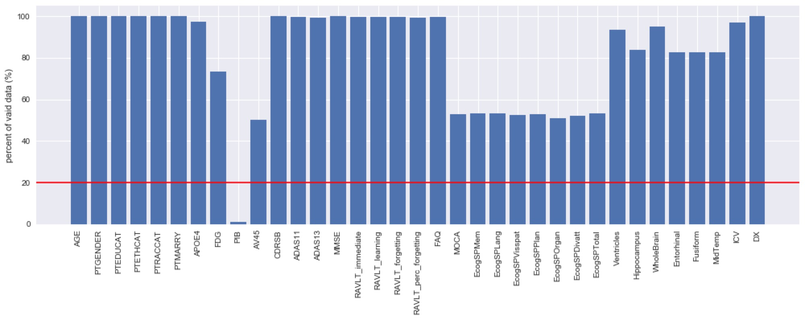
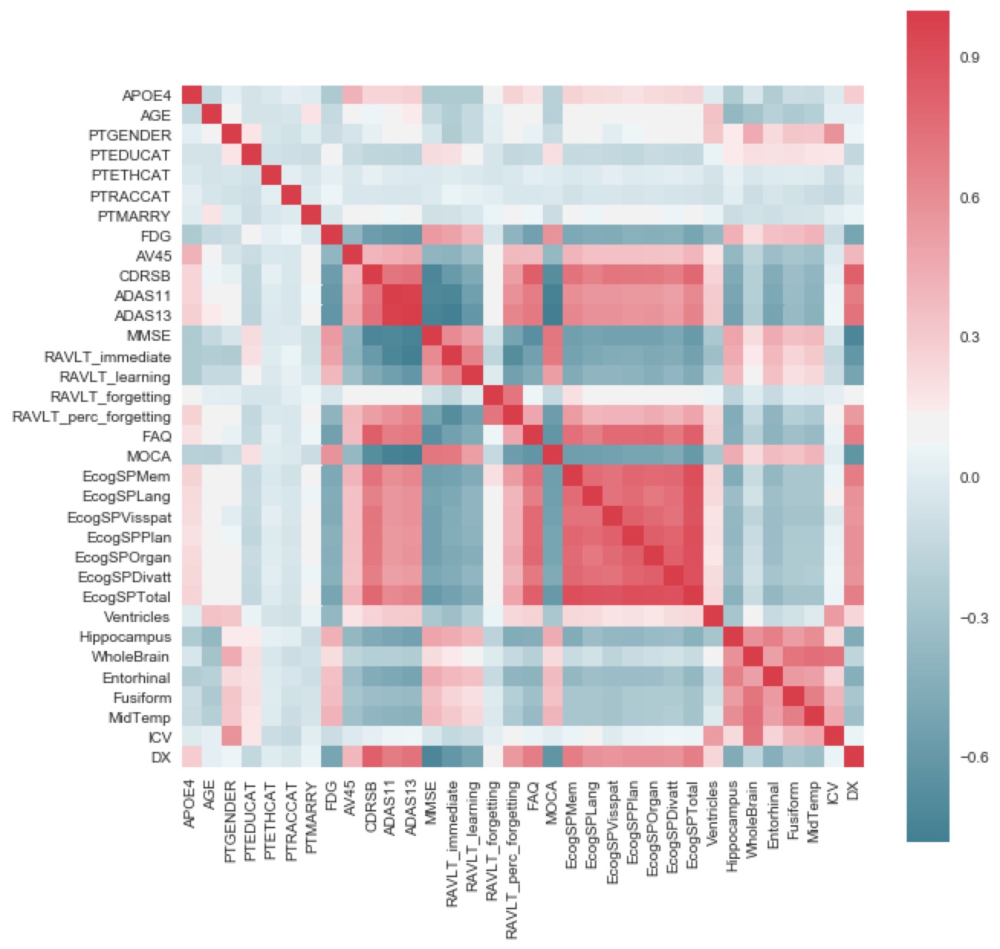
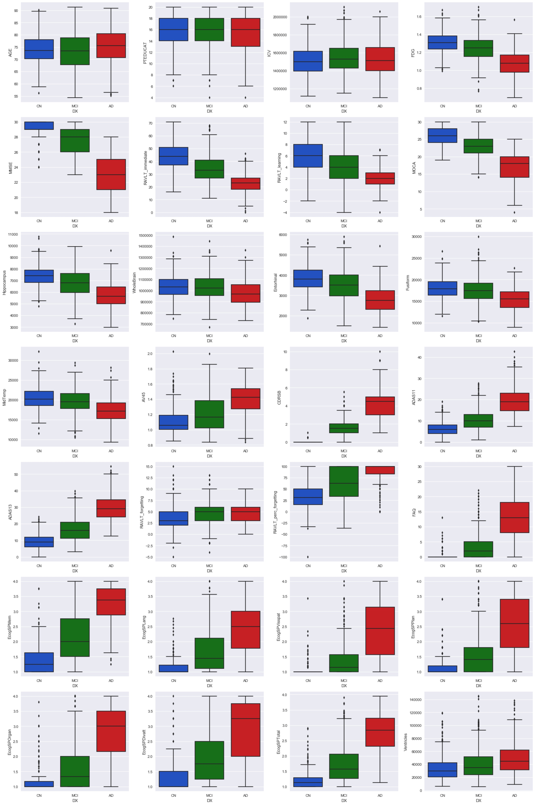
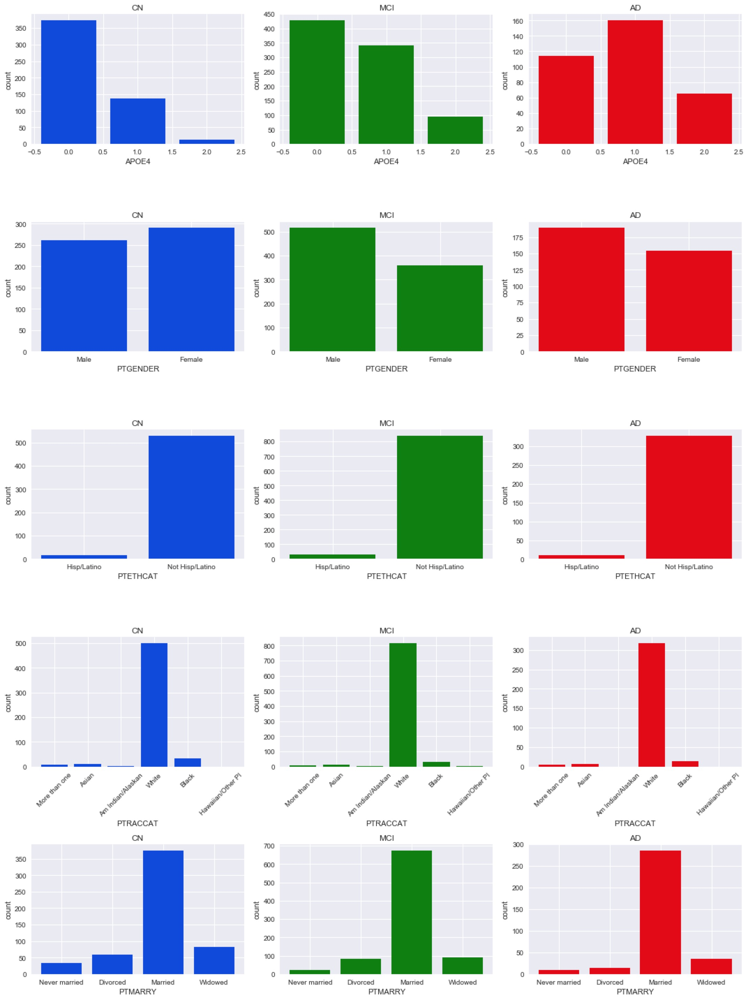

[Introduction](./index.html).|  [Exploratory data analysis](./EDA.html).|  [Models](./Models.html).|  [Conclusion](./Conclusion.html).|  [References](./References.html).

# Exploratory data analysis

## Data Description

We use data from ADNI dataset. This dataset is a longitudinal dataset, participants were carried forward from previous phases for continued monitoring while new enrollees were added with each phase to further investigate the evolution of AD. Participants of the study are between 55 to 90 years old, who are from 57 sites in the US and Canada. Participants would go through a series of initial tests and take repeated at intervals over subsequent years. Tests include clinical evaluation, neuropsychological tests, genetic testing, lumbar puncture, and MRI and PET scans. In this dataset, clinical data are obtained on for ADNI protocols, ADNI 1, ADNI 2, ADNI 3, ADNI GO, which comprise clinical information about each subject including recruitment, demographics, physical examinations, and cognitive assessment data, etc. Although they are not all the same regarding the date and completeness of measurement, as we are mainly focused on baseline biological and medical data and screening data for demographic, neurological exams, screening labs, vital signs, etc., which are almost complete for the four protocols, we do not differentiate different ADNI protocols when analyzing the data.

## Variables and Observations cleaning
For the use of exploratory data analysis (EDA), we first deleted observations that are not baseline values and observations that the response value ‘DX’ is missing. Since we just included necessary, not repetitive, baseline data and non-patient reported data, we dropped 58 variables inclduing ‘PTID’, ’SITE’, ‘COLPROT’, ‘ORIGPROT’, ‘EXAMDATE’, and all variables do not end with ‘bl’, ‘RID’, ‘Month’, ‘M’, ‘updated_stamp’, ‘FLDSTRNG’, ‘FSVERSION’, and all Ecog test results by the patients. Moreover, considering the completeness of data, we dropped variables that have missing values more than 80%. 

```
df = pd.read_csv('ADNIMERGE.csv')
```
```
#keep only the baseline value for all the variables. (also deleting "VISCODE")
df2 = {}
var = list(df.columns.drop('VISCODE'))
for i in var:
    df2[i] = df[i][df['VISCODE'] == 'bl']
df2 = pd.DataFrame(df2)
print(len(df)-len(df2), 'observation deleted. And variable "VISCODE" is deleted.')

#drop the observation if 'DX' is missing
df3 = {}
var = list(df2.columns.drop('DX'))
for i in var:
    df3[i] = df2[i][df2['DX'].isnull() == False]
df2['DX'].fillna(-1, inplace = True)
df2_DX = list(df2['DX'])
while -1 in df2_DX:
    df2_DX.remove(-1)
df3['DX'] = df2_DX
df3 = pd.DataFrame(df3)
print(len(df2)-len(df3), 'observation deleted.')
print(len(df3), 'observations left.')
```
11233 observation deleted. And variable "VISCODE" is deleted.
15 observation deleted.
1769 observations left.

```
#drop variables that are selected based on the criteria above
bad = ['PTID','SITE','COLPROT','ORIGPROT', 'EXAMDATE', 'DX_bl', 'EXAMDATE_bl', 
       'CDRSB_bl', 'ADAS11_bl', 'ADAS13_bl', 'MMSE_bl', 'RAVLT_immediate_bl', 'RAVLT_learning_bl', 'RAVLT_forgetting_bl', 
       'RAVLT_perc_forgetting_bl', 'FAQ_bl','FLDSTRENG_bl', 'FSVERSION_bl', 'Ventricles_bl', 'Hippocampus_bl', 
       'WholeBrain_bl', 'Entorhinal_bl', 'Fusiform_bl', 'MidTemp_bl', 'ICV_bl', 'MOCA_bl', 'EcogPtMem_bl', 'EcogPtLang_bl', 
       'EcogPtVisspat_bl', 'EcogPtPlan_bl', 'EcogPtOrgan_bl', 'EcogPtDivatt_bl', 'EcogPtTotal_bl', 'EcogSPMem_bl', 'EcogSPLang_bl', 
       'EcogSPVisspat_bl', 'EcogSPPlan_bl', 'EcogSPOrgan_bl', 'EcogSPDivatt_bl', 'EcogSPTotal_bl', 'FDG_bl', 'PIB_bl', 'AV45_bl', 
       'Years_bl', 'Month_bl', 'RID', 'Month', 'M', 'update_stamp', 'FLDSTRENG', 'FSVERSION','EcogPtMem', 'EcogPtLang', 'EcogPtVisspat', \
       'EcogPtPlan', 'EcogPtOrgan', 'EcogPtDivatt', 'EcogPtTotal']
df4 = df3.drop(bad, axis = 1)
print(len(list(df3.columns))-len(list(df4.columns)), 'variables are deleted.')
print('Remaining variables are:', list(df4.columns))
```
58 variables are deleted.
Remaining variables are: ['AGE', 'PTGENDER', 'PTEDUCAT', 'PTETHCAT', 'PTRACCAT', 'PTMARRY', 'APOE4', 'FDG', 'PIB', 'AV45', 'CDRSB', 'ADAS11', 'ADAS13', 'MMSE', 'RAVLT_immediate', 'RAVLT_learning', 'RAVLT_forgetting', 'RAVLT_perc_forgetting', 'FAQ', 'MOCA', 'EcogSPMem', 'EcogSPLang', 'EcogSPVisspat', 'EcogSPPlan', 'EcogSPOrgan', 'EcogSPDivatt', 'EcogSPTotal', 'Ventricles', 'Hippocampus', 'WholeBrain', 'Entorhinal', 'Fusiform', 'MidTemp', 'ICV', 'DX']

```
#cout the NaNs in each variables, drop variables that observations are not greater than 20%.
perc = []
bad2 = []
for i in list(df4.columns):
    perc_temp = (1-df4[i].isnull().sum()/len(df4))*100
    perc.append(perc_temp)
    if perc_temp < 0.2:
        bad2.append(i)
plt.figure(figsize=(17,5))
plt.bar(list(df4.columns), perc)
plt.xticks(list(df4.columns), rotation=90)
plt.axhline(20, c = 'r')
plt.ylabel('percent of vaid data (%)')
plt.show()
df5 = df4.drop(bad2, axis = 1)
print(len(list(df4.columns))-len(list(df5.columns)), 'variables are deleted.')
print('Deleted variables are:', bad2)
```
See **Fig 1**
1 variables are deleted.
Deleted variables are: ['PIB']

**Fig 1. Completeness of dataset after dropping unnecessary variables and observations**


## Correlation Analysis of Variables

Next, we identified continuous and categorical variables and converted the later to numbers for the convenience of further manipulation. To explore the current dataset, we first took a look at the correlations between any pairs of the variables without imputing missing values because the loss of data is small when doing correlation analysis, the probability of two variables either has a NaN is small, so we just delete any pair that either variable has a NaN. And the correlation matrix is drawn as below. 

**Fig 2. Correlation matrix including missing values after dropping unnecessary variables and observations**


## Distribution Exloration for Variables Grouped by Disease Status

Next, we plot the distribution of the variable across non-disease control (CN) participants, MCI participants, and AD participants. Shown in the below plots, we could see that AD, MCI, and CN are not very different across age(AGE), education level (PTEDUCAT), and intracerebral volume (ICV). The levels of Average FDG-PET of angular, temporal, and posterior cingulate
(FDG), Mini-Mental State Examination(MMSE), Hippocampus, WholeBrain, Entorhinal, Fusiform, middle temporal gyrus (MitTemp), etc. are negatively associated with cognitive impairment severity, while the scores of Clinical Dementia Rating-Sum of Boxes (CDRSB), FAQ, Ventricles, etc. are positively associated with cognitive impairment severity.  

**Fig 3. Distribution of continuous variables grouped by disease status**


**Fig 4. Distribution of categorical variables grouped by disease status**


According to the bar charts, the three health status have different distribution on demographic features. AD has a higher distribution in male, non-Hispanic, especially white, married people, and with APOE4=1. However, we are not sure about the determinants of classification yet since the results may due to the sampling method.

